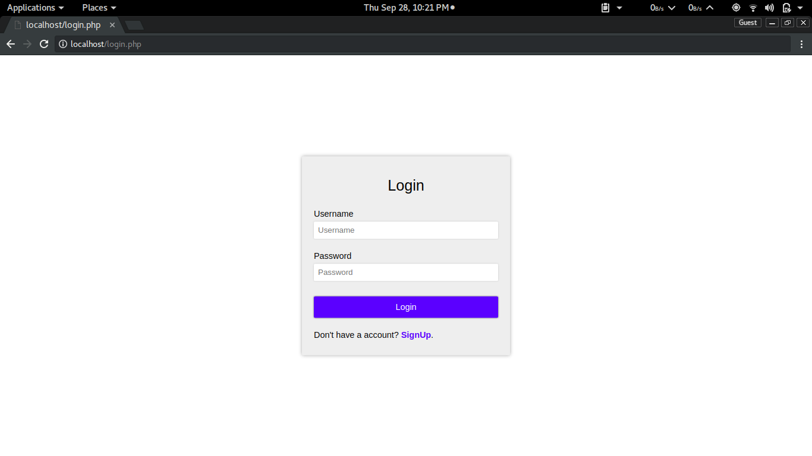
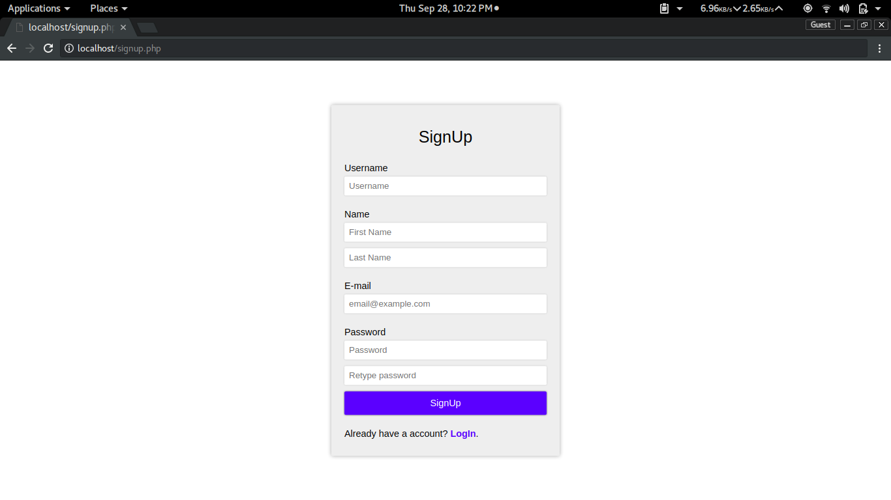
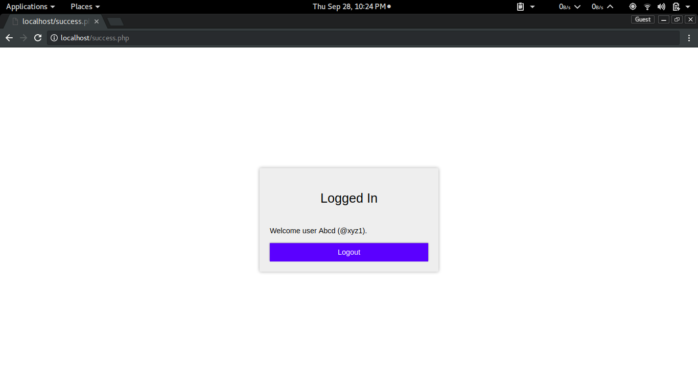
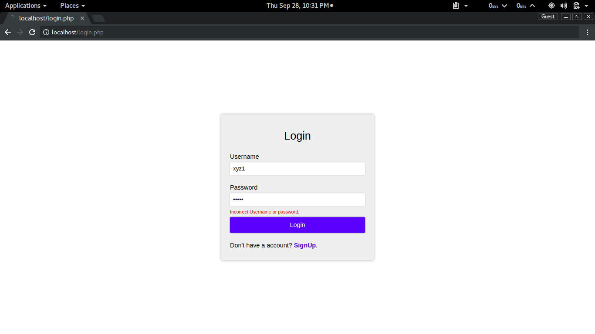
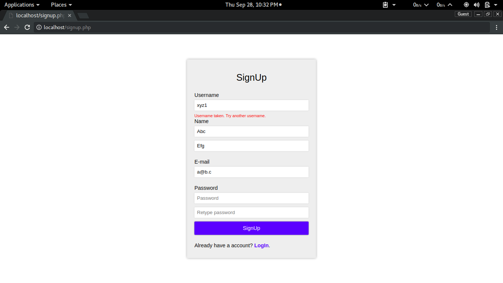
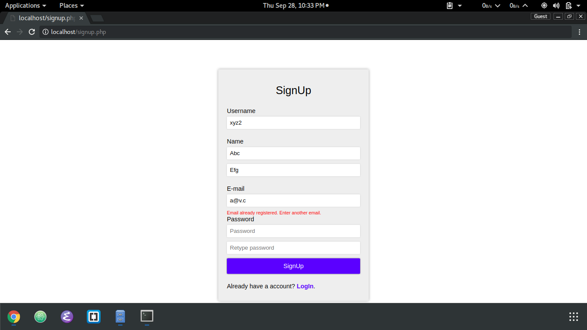
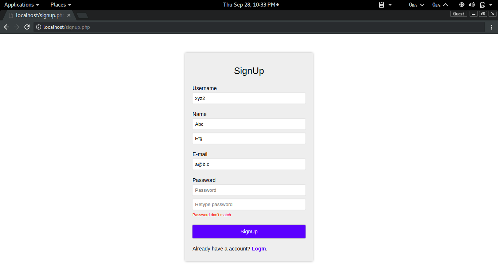

# Signup and login pages
This repository contains signup and login pages in **php** which use **mysql** database.


## Setup
To use this, copy contents of **src** folder to your web server root (assuming you have **LAMP**, **WAMP** or **MAMP** setup. if not, do it first.)

You have to create a mysql user named *'user'* and password *'password'* (which you can change in php files in **src**)

To do this, run mysql server in a command line shell and enter following **SQL**:

```sql
CREATE USER 'user'@'localhost' IDENTIFIED BY 'password';
```
```sql
GRANT ALL PRIVILEGES ON *.* TO 'user'@'localhost';
```
```sql
FLUSH PRIVILEGES;
```

You also have to create a database named login and a table name list by entering following **SQL** commands:

```sql
CREATE DATABASE login;
```
```sql
USE login;
```
```sql
CREATE TABLE list (
    id int not null auto_increment,
    user_name varchar(255) not null,
    first_name varchar(255) not null,
    last_name varchar(255) not null,
    email varchar(255) not null,
    password varchar(255) not null,
    PRIMARY KEY (id)
);
```

## About
The directory **src** contains 3 php files:
* signup.php
* login.php
* success.php

**signup.php** returns a form to client and validates using regular expressions on submit. It then connects to **mysql** server and checks for duplicate username or email and then inserts entry to database, creating new user and takes to **success.php**.

**login php** returns a form to client and on submitting, fetches data from database by usernames and compares passwords and on match, takes to  **success.php**, otherwise shows error to client.

**success.php** greets user and retains user session started in **signup.php** or **login.php**. It contains a logout button, which desroys session and takes to **login.php**. This page redirects to **login.php** if user session is not started and so,  it can't be accessed without logging in.

## Screenshots








___

The code is not clean, but good enough (I guess) ;)

You can add it to your server or website, and do anything you want, like improve style or appearance, improve code add new features etc.

Thanks ~ @deadfrominside :)
